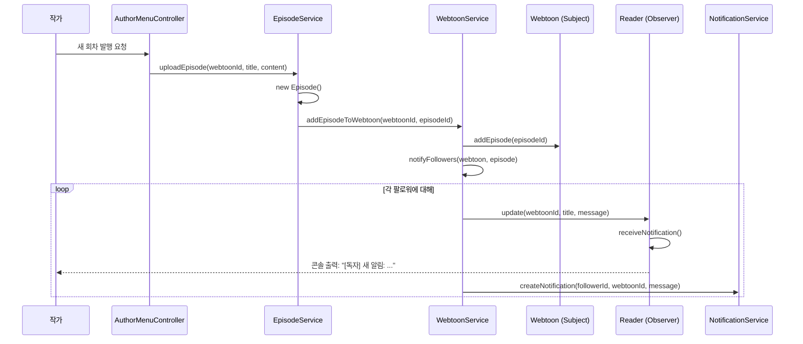

# 적용된 디자인 패턴

이 프로젝트는 3가지 디자인 패턴을 적용하여 유지보수성과 확장성을 확보했습니다.

---

## 1. Observer Pattern (관찰자 패턴)

### 목적

웹툰 팔로우 및 알림 시스템을 구현하기 위해 Observer 패턴을 적용했습니다. 작가가 새 회차를 발행하면 해당 웹툰을 팔로우하는 모든 독자에게 자동으로 알림이 전송됩니다.

### 적용 위치

- `com.webtoon.pattern.Observer` (Interface)
- `com.webtoon.pattern.Subject` (Interface)
- `com.webtoon.domain.Webtoon` (Subject 구현)
- `com.webtoon.domain.Reader` (Observer 구현)

### 클래스 다이어그램

```
┌─────────────────────┐          ┌─────────────────────┐
│    <<interface>>    │          │    <<interface>>    │
│      Subject        │          │      Observer       │
├─────────────────────┤          ├─────────────────────┤
│ + attach(userId)    │          │ + update(...)       │
│ + detach(userId)    │          │ + getUserId()       │
│ + notifyObservers() │          └─────────────────────┘
└─────────────────────┘                     △
          △                                 │
          │                                 │
          │                                 │
┌─────────────────────┐          ┌─────────────────────┐
│      Webtoon        │          │       Reader        │
├─────────────────────┤          ├─────────────────────┤
│ - followerUserIds   │          │ - notifications     │
│ - observers         │          │ - followingWebtoonIds│
├─────────────────────┤          ├─────────────────────┤
│ + attach(userId)    │          │ + update(...)       │
│ + detach(userId)    │          │ + followWebtoon()   │
│ + notifyObservers() │          │ + unfollowWebtoon() │
└─────────────────────┘          └─────────────────────┘
```

### 구현 상세

#### Subject Interface

```java
public interface Subject {
    /** 알림 주체 식별자 */
    String getSubjectId();

    /** 알림 주체 표시명 (작품명, 작가명 등) */
    String getSubjectName();

    /** 팔로워 추가 */
    void attach(Long userId);

    /** 팔로워 제거 */
    void detach(Long userId);

    /** 팔로워 목록 조회 */
    Set<Long> getFollowerUserIds();

    /** Observer 패턴 핵심: 팔로워들에게 알림 전송 */
    void notifyObservers();
}
```

#### Observer Interface

```java
public interface Observer {
    /** 웹툰 업데이트 알림 수신 */
    void update(Long webtoonId, String webtoonTitle, String message);

    /** Observer의 사용자 ID 반환 */
    Long getUserId();
}
```

#### Webtoon (Subject 구현)

```java
public class Webtoon implements Subject {
    private final Set<Long> followerUserIds = new HashSet<>();
    private transient List<Observer> observers = new ArrayList<>();

    @Override
    public void attach(Long userId) {
        followerUserIds.add(userId);
    }

    @Override
    public void detach(Long userId) {
        followerUserIds.remove(userId);
    }

    @Override
    public void notifyObservers() {
        if (id == null) return;

        String message = String.format("'%s'에 새 회차가 추가되었습니다.", title);

        for (Observer observer : observers) {
            if (followerUserIds.contains(observer.getUserId())) {
                observer.update(id, title, message);
            }
        }
    }
}
```

#### Reader (Observer 구현)

```java
public class Reader extends User implements Observer {
    private List<Long> followingWebtoonIds;
    private List<Notification> notifications;

    @Override
    public void update(Long webtoonId, String webtoonTitle, String message) {
        receiveNotification(webtoonId, message);
        System.out.println("[" + nickname + "] 새 알림: " + message);
    }

    @Override
    public Long getUserId() {
        return this.getId();
    }

    public void followWebtoon(Long webtoonId) {
        if (!followingWebtoonIds.contains(webtoonId)) {
            followingWebtoonIds.add(webtoonId);
        }
    }
}
```

### 실행 흐름

1. **독자가 웹툰 팔로우**
   - `ReaderService.followWebtoon(readerId, webtoonId)` 호출
   - `Webtoon.attach(readerId)`: 팔로워 목록에 추가
   - `Reader.followWebtoon(webtoonId)`: 독자의 팔로우 목록에 추가

2. **작가가 새 회차 발행**
   - `EpisodeService.uploadEpisode(webtoonId, title, content)` 호출
   - `WebtoonService.addEpisodeToWebtoon(webtoonId, episodeId)` 호출
   - `WebtoonService.notifyFollowers(webtoon, episode)` 호출

3. **팔로워들에게 알림 전송**

```java
private void notifyFollowers(Webtoon webtoon, Episode episode) {
    String message = String.format("'%s'에 새 회차가 추가되었습니다.", webtoon.getTitle());

    for (Long followerId : webtoon.getFollowerUserIds()) {
        userRepository.findById(followerId).ifPresent(user -> {
            if (user instanceof Reader) {
                Reader reader = (Reader) user;
                // Observer 패턴: Reader.update() 호출
                reader.update(webtoon.getId(), webtoon.getTitle(), message);
                // NotificationRepository에 저장
                notificationService.createNotification(followerId, webtoon.getId(), message);
            }
        });
    }
}
```

### 시퀀스 다이어그램



### 장점

- **느슨한 결합**: Webtoon과 Reader가 직접 의존하지 않고 Interface를 통해 통신
- **확장성**: 새로운 Observer 타입 추가 용이 (예: Email 알림, Push 알림)
- **단일 책임 원칙**: 알림 전송 로직이 Webtoon에서 분리됨

---

## 2. Strategy Pattern (전략 패턴)

### 목적

회차 접근 방식(대여/구매)과 결제 수단을 전략으로 분리하여 런타임에 선택할 수 있도록 합니다.

### 2.1 AccessStrategy (접근 전략)

회차를 대여할지 구매할지에 따라 다른 로직을 실행합니다.

#### 적용 위치

- `com.webtoon.pattern.AccessStrategy` (Interface)
- `com.webtoon.pattern.RentalAccessStrategy` (구현체)
- `com.webtoon.pattern.PurchaseAccessStrategy` (구현체)
- `com.webtoon.service.AccessService` (Context)

#### 클래스 다이어그램

```
┌──────────────────────────┐
│     <<interface>>        │
│    AccessStrategy        │
├──────────────────────────┤
│ + execute(...)           │
│ + canAccess(...)         │
│ + getStrategyName()      │
└──────────────────────────┘
          △
          │
          ├───────────────────────┬──────────────────────┐
          │                       │                      │
┌─────────────────────┐  ┌─────────────────────┐  ┌──────────────┐
│ RentalAccessStrategy│  │PurchaseAccessStrategy│  │ ... (확장)   │
├─────────────────────┤  ├─────────────────────┤  └──────────────┘
│ + execute()         │  │ + execute()         │
│ + canAccess()       │  │ + canAccess()       │
└─────────────────────┘  └─────────────────────┘
                                  △
                                  │
                        ┌──────────────────┐
                        │  AccessService   │  (Context)
                        ├──────────────────┤
                        │ + grantAccess()  │
                        └──────────────────┘
```

#### Interface

```java
public interface AccessStrategy {
    /** 전략 실행: Rental 또는 Purchase 객체 반환 */
    Object execute(Reader reader, Episode episode, Clock clock);

    /** 접근 가능 여부 판단 */
    boolean canAccess(Reader reader, Episode episode, Clock clock);

    /** 전략 이름 */
    String getStrategyName();
}
```

#### RentalAccessStrategy (대여 전략)

```java
public class RentalAccessStrategy implements AccessStrategy {
    @Override
    public Object execute(Reader reader, Episode episode, Clock clock) {
        int rentPrice = episode.getRentPrice();

        // 포인트 부족 확인
        if (reader.getPoints() < rentPrice) {
            return null;  // 실패
        }

        // 포인트 차감
        reader.usePoints(rentPrice);

        // 대여 기록 생성 (10분 만료)
        LocalDateTime expireAt = LocalDateTime.now(clock).plusMinutes(10);
        return new Rental(reader.getId(), episode.getId(), expireAt);
    }

    @Override
    public String getStrategyName() {
        return "대여";
    }
}
```

#### PurchaseAccessStrategy (구매 전략)

```java
public class PurchaseAccessStrategy implements AccessStrategy {
    @Override
    public Object execute(Reader reader, Episode episode, Clock clock) {
        int buyPrice = episode.getBuyPrice();

        // 포인트 부족 확인
        if (reader.getPoints() < buyPrice) {
            return null;  // 실패
        }

        // 포인트 차감
        reader.usePoints(buyPrice);

        // 구매 기록 생성 (영구)
        return new Purchase(
            null,
            reader.getId(),
            episode.getId(),
            buyPrice,
            LocalDateTime.now(clock)
        );
    }

    @Override
    public String getStrategyName() {
        return "구매";
    }
}
```

#### AccessService (Context)

```java
public class AccessService {
    private final RentalRepository rentalRepository;
    private final PurchaseRepository purchaseRepository;

    /**
     * 접근 권한 부여
     * - strategy 매개변수로 대여/구매 전략을 선택
     * - 중복 구매 방지, 대여->구매 전환 시 차액 정산 로직 포함
     */
    public boolean grantAccess(Reader reader, Episode episode, AccessStrategy strategy, Clock clock) {
        // 1) 이미 구매했다면 재구매 불가
        boolean alreadyPurchased = purchaseRepository.findByReaderId(reader.getId()).stream()
                .anyMatch(p -> p.getEpisodeId().equals(episode.getId()));
        if (alreadyPurchased) {
            return false;  // 이미 소장 중
        }

        // 2) 대여 중 -> 구매 전환 시 차액만 차감
        if (strategy instanceof PurchaseAccessStrategy) {
            boolean hasActiveRental = rentalRepository.findByReaderId(reader.getId()).stream()
                    .filter(r -> r.getEpisodeId().equals(episode.getId()))
                    .anyMatch(r -> !r.isExpired(clock));

            if (hasActiveRental) {
                int diff = episode.getBuyPrice() - episode.getRentPrice();
                if (diff > 0) {
                    if (!reader.usePoints(diff)) {
                        return false;  // 포인트 부족
                    }
                }
                Purchase purchase = new Purchase(
                    null,
                    reader.getId(),
                    episode.getId(),
                    episode.getBuyPrice(),
                    LocalDateTime.now(clock)
                );
                purchaseRepository.save(purchase);
                readerRepository.update(reader);
                return true;
            }
        }

        // 3) 일반 케이스: 전략에 위임
        Object result = strategy.execute(reader, episode, clock);
        if (result == null) return false;

        if (result instanceof Rental rental) {
            rentalRepository.save(rental);
        } else if (result instanceof Purchase purchase) {
            purchaseRepository.save(purchase);
        }

        readerRepository.update(reader);
        return true;
    }
}
```

#### 사용 예시

```java
// 대여
AccessStrategy rentalStrategy = new RentalAccessStrategy();
boolean success = accessService.grantAccess(reader, episode, rentalStrategy, Clock.systemDefaultZone());

// 구매
AccessStrategy purchaseStrategy = new PurchaseAccessStrategy();
boolean success = accessService.grantAccess(reader, episode, purchaseStrategy, Clock.systemDefaultZone());
```

### 2.2 PaymentStrategy (결제 전략)

포인트 충전 시 결제 수단을 선택할 수 있습니다.

#### 적용 위치

- `com.webtoon.pattern.PaymentStrategy` (Interface)
- `com.webtoon.pattern.CreditCardPaymentStrategy` (구현체)
- `com.webtoon.pattern.BankTransferPaymentStrategy` (구현체)
- `com.webtoon.service.PointService` (Context)

#### Interface

```java
public interface PaymentStrategy {
    /** 결제 처리 (데모: 항상 성공) */
    boolean processPayment(int amount);

    /** 결제 수단 이름 */
    String getPaymentMethodName();
}
```

#### 구현체

```java
public class CreditCardPaymentStrategy implements PaymentStrategy {
    @Override
    public boolean processPayment(int amount) {
        // 실제로는 PG사 API 호출
        return true;  // 데모: 항상 성공
    }

    @Override
    public String getPaymentMethodName() {
        return "신용카드";
    }
}

public class BankTransferPaymentStrategy implements PaymentStrategy {
    @Override
    public boolean processPayment(int amount) {
        // 실제로는 은행 API 호출
        return true;  // 데모: 항상 성공
    }

    @Override
    public String getPaymentMethodName() {
        return "계좌이체";
    }
}
```

#### PointService (Context)

```java
public class PointService {
    public boolean chargePoints(Reader reader, int amount, PaymentStrategy paymentStrategy) {
        // 결제 처리
        if (!paymentStrategy.processPayment(amount)) {
            return false;  // 결제 실패
        }

        // 포인트 적립 (1원 = 1P)
        reader.addPoints(amount);

        // 결제 이력 저장
        PaymentHistory history = new PaymentHistory(
            null,
            reader.getId(),
            amount,
            paymentStrategy.getPaymentMethodName(),
            amount,
            LocalDateTime.now()
        );
        paymentHistoryRepository.save(history);
        readerRepository.update(reader);

        return true;
    }
}
```

### 장점

- **개방-폐쇄 원칙**: 새로운 전략 추가 시 기존 코드 수정 불필요
- **런타임 교체**: 실행 중에 전략을 동적으로 변경 가능
- **테스트 용이**: 각 전략을 독립적으로 테스트 가능

---

## 3. Repository Pattern (저장소 패턴)

### 목적

데이터 접근 로직을 비즈니스 로직과 분리하고, 데이터 저장소 변경 시 Service 계층에 영향을 주지 않도록 합니다.

### 적용 위치

- `com.webtoon.common.repository.JsonRepository<T>` (추상 베이스 클래스)
- `com.webtoon.repository.*Repository` (Interface)
- `com.webtoon.repository.Json*Repository` (JSON 구현체)
- `com.webtoon.repository.InMemory*Repository` (In-Memory 구현체)

### 클래스 다이어그램

```
┌────────────────────────────┐
│  <<abstract>>              │
│  JsonRepository<T>         │
├────────────────────────────┤
│ # getFileName()            │
│ # getEntityClass()         │
│ # getId(entity)            │
│ # setId(entity, id)        │
├────────────────────────────┤
│ + save(entity)             │
│ + findById(id)             │
│ + findAll()                │
│ + deleteById(id)           │
└────────────────────────────┘
              △
              │
    ┌─────────┴─────────┬──────────────┐
    │                   │              │
┌───────────────┐  ┌────────────┐  ┌──────────────┐
│JsonWebtoon    │  │JsonEpisode │  │JsonReader    │
│Repository     │  │Repository  │  │Repository    │
└───────────────┘  └────────────┘  └──────────────┘
```

### 구현 상세

#### 추상 베이스 클래스

```java
public abstract class JsonRepository<T> {
    private static final Gson GSON = new GsonBuilder()
            .setPrettyPrinting()
            .registerTypeAdapter(LocalDateTime.class, new LocalDateTimeAdapter())
            .create();

    private final ReentrantReadWriteLock lock = new ReentrantReadWriteLock();

    /** 서브클래스가 구현해야 할 메서드들 */
    protected abstract String getFileName();
    protected abstract Class<T> getEntityClass();
    protected abstract Long getId(T entity);
    protected abstract void setId(T entity, Long id);

    /** 파일 경로 */
    private String getFilePath() {
        return "src/main/resources/data/" + getFileName() + ".json";
    }

    /** 엔티티 저장 */
    public T save(T entity) {
        lock.writeLock().lock();
        try {
            List<T> entities = loadFromFile();
            Long id = getId(entity);

            if (id == null) {
                // 신규 - ID 자동 생성
                Long nextId = getNextId();
                setId(entity, nextId);
                entities.add(entity);
            } else {
                // 업데이트 - 기존 엔티티 교체
                entities.removeIf(e -> getId(e).equals(id));
                entities.add(entity);
            }

            saveToFile(entities);
            return entity;
        } finally {
            lock.writeLock().unlock();
        }
    }

    /** ID로 조회 */
    public Optional<T> findById(Long id) {
        lock.readLock().lock();
        try {
            return loadFromFile().stream()
                    .filter(e -> getId(e).equals(id))
                    .findFirst();
        } finally {
            lock.readLock().unlock();
        }
    }

    /** 전체 조회 */
    public List<T> findAll() {
        lock.readLock().lock();
        try {
            return new ArrayList<>(loadFromFile());
        } finally {
            lock.readLock().unlock();
        }
    }

    /** 파일 로드 (UTF-8) */
    private List<T> loadFromFile() {
        Path path = Paths.get(getFilePath());
        if (!Files.exists(path)) {
            return new ArrayList<>();
        }

        try {
            String json = Files.readString(path, StandardCharsets.UTF_8);
            Type listType = TypeToken.getParameterized(List.class, getEntityClass()).getType();
            List<T> entities = GSON.fromJson(json, listType);
            return entities != null ? entities : new ArrayList<>();
        } catch (IOException e) {
            throw new RuntimeException("JSON 파일 읽기 실패: " + getFilePath(), e);
        }
    }

    /** 파일 저장 (UTF-8) */
    private void saveToFile(List<T> entities) {
        Path path = Paths.get(getFilePath());
        try {
            Files.createDirectories(path.getParent());
            String json = GSON.toJson(entities);
            Files.writeString(path, json, StandardCharsets.UTF_8);
        } catch (IOException e) {
            throw new RuntimeException("JSON 파일 쓰기 실패: " + getFilePath(), e);
        }
    }
}
```

#### 구현 예시

```java
public class JsonWebtoonRepository extends JsonRepository<Webtoon> implements WebtoonRepository {
    @Override
    protected String getFileName() {
        return "webtoons";
    }

    @Override
    protected Class<Webtoon> getEntityClass() {
        return Webtoon.class;
    }

    @Override
    protected Long getId(Webtoon entity) {
        return entity.getId();
    }

    @Override
    protected void setId(Webtoon entity, Long id) {
        entity.setId(id);
    }
}
```

### 특징

- **Generic 기반**: 타입 안정성 확보
- **동시성 제어**: ReentrantReadWriteLock으로 Read/Write 분리
- **Auto Increment ID**: 자동 ID 생성
- **UTF-8 보장**: 맥/윈도우 호환성
- **In-Memory 구현체**: 테스트용 (영속화 없음)

### 장점

- **데이터 저장소 교체 용이**: JSON -> DB 전환 시 Repository 구현체만 교체
- **테스트 용이**: In-Memory 구현체로 빠른 테스트 가능
- **관심사 분리**: Service는 데이터 저장 방식을 알 필요 없음

---

## 패턴 적용 효과

| 패턴 | 주요 효과 |
|------|----------|
| Observer | 웹툰-독자 간 느슨한 결합, 실시간 알림 시스템 구현 |
| Strategy | 대여/구매/결제 수단 확장성, 런타임 전략 교체 |
| Repository | 데이터 저장소 교체 용이, Service 계층 독립성 확보 |

이러한 패턴들은 각각의 책임을 명확히 분리하고, 향후 기능 추가나 변경 시 최소한의 수정으로 대응할 수 있도록 시스템을 설계했습니다.
